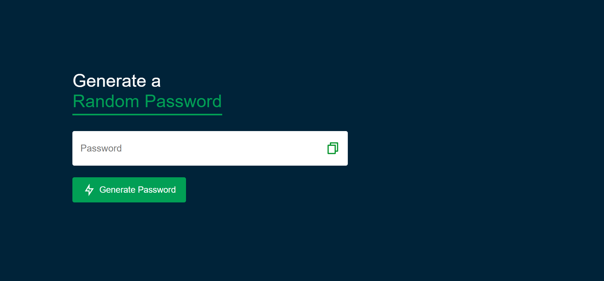

# Random Password Generator

A simple web application to generate random passwords using HTML, CSS, and JavaScript.

## Features

- Generates random passwords of specified length.
- Option to include uppercase letters, lowercase letters, numbers, and special characters.
- Easy to use interface with copy-to-clipboard functionality.

## Screenshots

## Getting Started

### Prerequisites

To run this project, you only need a modern web browser.

### Usage

1. Open the application in your web browser.
2. Click the "Generate Password" button to generate a random password.
3. Click the "Copy Icon" button to copy the generated password.
